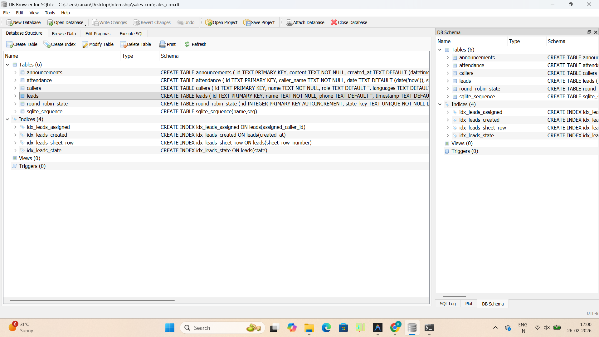
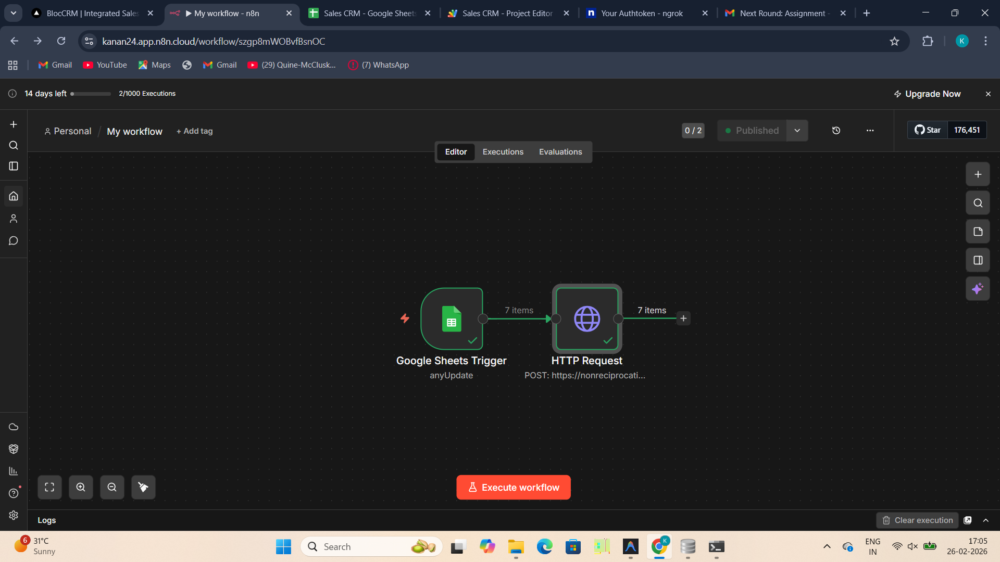

# Sales CRM — Smart Lead Management & Automation

> A real-time Sales CRM web application that ingests leads from **Google Sheets**, automatically assigns them to sales callers using **Round Robin logic**, and provides a clean dashboard for managing the sales pipeline.

---

## Table of Contents

1. [System Architecture](#system-architecture)
2. [Tech Stack](#tech-stack)
3. [Database Structure](#database-structure)
4. [Development Logic](#development-logic)
5. [Automation Workflow](#automation-workflow)
6. [How Automation is Triggered](#how-automation-is-triggered)
7. [Setup Instructions](#setup-instructions)
8. [What I Would Improve With More Time](#what-i-would-improve-with-more-time)

---

## System Architecture

```
┌──────────────────┐     ┌──────────────────────┐     ┌──────────────────────┐
│  Google Sheets   │────▶│   n8n Workflow        │────▶│   Ngrok Tunnel       │
│  (Lead Source)   │     │  Google Sheets Trigger│     │  (Public HTTPS URL)  │
│  anyUpdate event │     │  → HTTP POST Request  │     │  → localhost:3000    │
└──────────────────┘     └──────────────────────┘     └──────────┬───────────┘
                                                                  │
                                                                  ▼
┌──────────────────┐                              ┌──────────────────────────┐
│   Next.js UI     │◀─────── Real-time Polling ───│   Next.js API Routes     │
│   (React)        │                              │   /api/webhook/new-lead  │
│   - Dashboard    │                              │   /api/sync-leads        │
│   - Leads Page   │                              │   /api/callers           │
│   - Callers Page │                              └──────────┬───────────────┘
└──────────────────┘                                         │
                                                             ▼
                                                ┌──────────────────────────┐
                                                │   SQLite Database        │
                                                │   - leads                │
                                                │   - callers              │
                                                │   - round_robin_state    │
                                                │   - announcements        │
                                                │   - attendance           │
                                                └──────────────────────────┘
```

---

## Tech Stack

| Layer       | Technology                          |
|-------------|-------------------------------------|
| Frontend    | Next.js 16 (App Router, React 19)   |
| Backend     | Next.js API Routes                  |
| Database    | SQLite (via `better-sqlite3`)       |
| Sheets API  | Google Sheets API (`googleapis`)    |
| Automation  | n8n Cloud Workflow                  |
| Tunnel      | Ngrok (exposes localhost publicly)  |
| Styling     | Vanilla CSS (dark theme)            |

---

## Database Structure

The project uses **SQLite** (file-based, zero-config) via the `better-sqlite3` library. The database file is `sales_crm.db` at the project root.

### Tables Overview



---

### `callers` — Sales Team Members

| Column             | Type    | Description                                      |
|--------------------|---------|--------------------------------------------------|
| `id`               | TEXT PK | Auto-generated UUID                              |
| `name`             | TEXT    | Caller's full name                               |
| `role`             | TEXT    | Job role (e.g., Regional Lead, Senior Specialist)|
| `languages`        | TEXT    | JSON array of languages (Hindi, English, etc.)   |
| `daily_lead_limit` | INTEGER | Max leads per day (default: 60)                  |
| `assigned_states`  | TEXT    | JSON array of states they handle                 |
| `created_at`       | TEXT    | Timestamp of creation                            |

**Sample Data:**

| Name       | Role              | Languages              | Daily Limit | States        |
|------------|-------------------|------------------------|-------------|---------------|
| Ahaan      | Regional Lead     | Hindi, English, Marathi| 60          | Maharashtra   |
| Gayatri    | Senior Specialist | Kannada, English       | 60          | Karnataka     |
| Kanan      | Senior Specialist | Hindi, English         | 60          | Rajasthan     |
| Navneet    | Senior Specialist | Hindi, English         | 60          | Rajasthan     |

---

### `leads` — Incoming Leads from Google Sheets

| Column               | Type    | Description                                    |
|----------------------|---------|------------------------------------------------|
| `id`                 | TEXT PK | Auto-generated UUID                            |
| `name`               | TEXT    | Lead's full name                               |
| `phone`              | TEXT    | Phone number                                   |
| `timestamp`          | TEXT    | When the lead was created in the Sheet         |
| `lead_source`        | TEXT    | Source (Facebook Ads, Instagram, Referral, etc)|
| `city`               | TEXT    | Lead's city                                    |
| `state`              | TEXT    | Lead's state (used for smart assignment)       |
| `metadata`           | TEXT    | Additional notes or context                    |
| `sheet_row_number`   | INTEGER | Google Sheet row number (prevents duplicates)  |
| `assigned_caller_id` | TEXT FK | FK → `callers(id)` — assigned sales caller     |
| `created_at`         | TEXT    | When the lead was synced into the CRM          |

**Sample Data:**

| Name          | Phone      | Source       | City      | State         |
|---------------|------------|--------------|-----------|---------------|
| Aarav Gupta   | 9876543210 | Facebook Ads | Mumbai    | Maharashtra   |
| Vikram Singh  | 7654321098 | LinkedIn     | Delhi     | Delhi         |
| Ananya Iyer   | 6543210987 | Referral     | Kota      | Rajasthan     |
| Kabir Malhotra| 9988776655 | Instagram    | Chennai   | Tamil Nadu    |
| Ishani Verma  | 8769432109 | Google Search| Bangalore | Karnataka     |

---

### `round_robin_state` — Tracks Fair Distribution

| Column           | Type    | Description                                         |
|------------------|---------|-----------------------------------------------------|
| `id`             | INTEGER | Auto-increment PK                                   |
| `state_key`      | TEXT UQ | State name or `__global__` for fallback             |
| `last_caller_id` | TEXT FK | Last caller assigned for this state group           |

---

### `announcements` — Team Announcements

| Column       | Type    | Description                 |
|--------------|---------|-----------------------------|
| `id`         | TEXT PK | Auto-generated UUID         |
| `content`    | TEXT    | Announcement message        |
| `created_at` | TEXT    | Timestamp                   |

---

### `attendance` — Daily Attendance Tracking

| Column        | Type | Description                          |
|---------------|------|--------------------------------------|
| `id`          | TEXT | Auto-generated UUID                  |
| `caller_name` | TEXT | Name of the caller                   |
| `date`        | DATE | Date of attendance                   |
| `status`      | TEXT | Present / Absent (default: Present)  |

---

## Development Logic

### Smart Lead Assignment (Round Robin)

When a new lead arrives via webhook, the API follows this decision tree:

```
New Lead Arrives via Webhook
        │
        ▼
Does lead have a state field?
        │
   ┌────┴────┐
  Yes       No
   │         │
   ▼         ▼
Find callers  Use all  
assigned to   available
that state    callers
   │         │
   ▼         │
Any callers? │
   │         │
 ┌─┴─┐       │
Yes  No──────┤
 │           │
 ▼           ▼
Filter out callers at daily cap
        │
        ▼
Round Robin among remaining eligible callers
(tracked per state group using round_robin_state table)
        │
        ▼
Assign lead → update assigned_caller_id
```

**Key Rules:**
1. 🗺️ **State-Based Assignment** — Lead from Maharashtra → finds callers with Maharashtra in their `assigned_states`
2. 📊 **Daily Cap Enforcement** — If a caller has hit their `daily_lead_limit`, they are skipped
3. 🔄 **Round Robin Rotation** — Uses `round_robin_state` to remember who was last assigned, ensuring fair distribution
4. 🌐 **Global Fallback** — If no state-specific callers exist, all available callers participate in the rotation

### Duplicate Prevention
- Every lead from Google Sheets carries a `sheet_row_number`
- The `leads` table has a `UNIQUE` constraint on `sheet_row_number`
- If the webhook receives the same row again, the INSERT silently skips it — no duplicate entries

### API Routes
| Method | Endpoint                   | Purpose                              |
|--------|----------------------------|--------------------------------------|
| POST   | `/api/webhook/new-lead`    | Receives a single lead from n8n/Apps Script |
| GET    | `/api/sync-leads`          | Bulk syncs all rows from Google Sheets |
| GET    | `/api/callers`             | Fetches all callers                  |
| POST   | `/api/callers`             | Adds a new caller                    |
| DELETE | `/api/callers`             | Removes a caller                     |
| GET    | `/api/leads`               | Fetches all leads with caller info   |
| DELETE | `/api/leads`               | Purges a lead from the database      |

---

## Automation Workflow

The automation uses **n8n Cloud** to watch Google Sheets and forward new leads to the CRM in real time.

### n8n Workflow — Two Nodes



| Node | Type | Function |
|------|------|----------|
| **Google Sheets Trigger** | Trigger | Fires on `anyUpdate` — detects new or edited rows |
| **HTTP Request** | Action | Sends HTTP POST to the ngrok webhook URL with lead data |

**Payload sent by n8n to the webhook:**
```json
{
  "name": "Lead Name",
  "phone": "9876543210",
  "timestamp": "2026-02-26T05:00:00Z",
  "lead_source": "Facebook Ads",
  "city": "Mumbai",
  "state": "Maharashtra",
  "metadata": "Interested in product demo",
  "sheet_row_number": 5
}
```

---

## How Automation is Triggered

### Method 1: n8n Cloud Workflow (Primary — Currently Active ✅)

1. A new row is added (or any row is updated) in the **Google Sheet**
2. **n8n's Google Sheets Trigger** detects the change (`anyUpdate` event)
3. n8n sends an **HTTP POST** request to the ngrok public URL → `/api/webhook/new-lead`
4. The Next.js API receives the payload, runs the **Round Robin assignment logic**, and saves the lead to SQLite
5. The **UI dashboard polls** the API every few seconds and displays the new lead

```
Google Sheets update
      ↓
n8n Trigger (anyUpdate)
      ↓
HTTP POST → https://xxxx.ngrok-free.app/api/webhook/new-lead
      ↓
Next.js API → Round Robin Assignment → Save to SQLite
      ↓
UI Dashboard reflects the new lead
```

> **Note:** Because this project runs locally, **Ngrok** is required to expose `localhost:3000` to a public HTTPS URL that n8n can reach. Every time you restart, you must update the ngrok URL in your n8n HTTP Request node.

### Method 2: Manual Sync via Dashboard

Click the **"Sync Google Sheets"** button on the Dashboard — this calls `/api/sync-leads` which bulk-fetches all rows from the Google Sheet and upserts them into the database.

### Method 3: Google Apps Script (Alternative — Zero Cost)

1. Open Google Sheets → **Extensions → Apps Script**
2. Paste the code from `google-apps-script.js` in this repo
3. Set the `WEBHOOK_URL` constant to your ngrok URL + `/api/webhook/new-lead`
4. Run `createTrigger()` once to activate an **on-edit trigger**

---

## Setup Instructions

### Prerequisites
- Node.js 18+
- ngrok installed (`winget install ngrok` or download from [ngrok.com](https://ngrok.com))
- A Google Sheet with columns: `Name | Phone | Timestamp | Lead Source | City | State | Metadata`
- An n8n account (free at [n8n.cloud](https://n8n.cloud))

---

### Step 1: Clone & Install

```bash
git clone <repo-url>
cd sales-crm
npm install
```

---

### Step 2: Configure Environment Variables

Copy `.env.example` to `.env.local` and fill in your values:

```env
# Google Sheets Integration
GOOGLE_SHEET_ID=your-sheet-id-from-url
GOOGLE_SERVICE_ACCOUNT_KEY={"type":"service_account","project_id":"..."}
```

To get your Google Service Account key:
1. Go to [console.cloud.google.com](https://console.cloud.google.com)
2. Create a project → Enable **Google Sheets API**
3. Create a **Service Account** → Download JSON key
4. Share your Google Sheet with the service account email (`...@....iam.gserviceaccount.com`)
5. Paste the entire JSON as a single line into `GOOGLE_SERVICE_ACCOUNT_KEY`

---

### Step 3: Run the App

Open **Terminal 1** — start the Next.js server:
```bash
npm run dev
```
App will be at `http://localhost:3000`

Open **Terminal 2** — start ngrok:
```bash
ngrok http 3000
```
Copy the HTTPS URL shown (e.g., `https://xxxx.ngrok-free.app`)

---

### Step 4: Configure n8n Workflow

1. Go to [n8n.cloud](https://n8n.cloud) and create a new workflow
2. Add a **Google Sheets Trigger** node → connect your Google account → select your sheet → set event to `Any Update`
3. Add an **HTTP Request** node:
   - Method: `POST`
   - URL: `https://xxxx.ngrok-free.app/api/webhook/new-lead` ← your ngrok URL
   - Body: Map the Google Sheets fields to the JSON payload format shown above
4. **Activate** the workflow (toggle Published)

---

### Step 5: Add Callers

1. Open the CRM at `http://localhost:3000`
2. Go to **Callers** page → Add your sales team members
3. Set their assigned states and daily lead limits
4. Now every new lead from Google Sheets will automatically be assigned!

---

## What I Would Improve With More Time

1. **🔌 WebSocket / Server-Sent Events** instead of polling — true real-time updates via Supabase Realtime or Socket.io
2. **📋 Lead Detail View** — click on a lead to see activity timeline, notes, follow-up history
3. **📊 Analytics Dashboard** — charts for leads per day, caller performance, conversion rates
4. **🔐 Authentication** — role-based access control (admin vs caller view) using NextAuth.js
5. **🔄 Bulk Reassignment** — when a caller goes unavailable, redistribute their leads automatically
6. **🏷️ Lead Status Pipeline** — track stages: New → Contacted → Qualified → Converted → Lost
7. **📄 Pagination** — handle large datasets (1000+ leads) without performance issues
8. **🛡️ Rate Limiting** — protect webhook endpoints from abuse using middleware
9. **☁️ Cloud Deployment** — deploy on Vercel with a proper cloud database (PlanetScale, Supabase, or Railway)
10. **🧪 Automated Tests** — unit tests for Round Robin edge cases, integration tests for API routes
